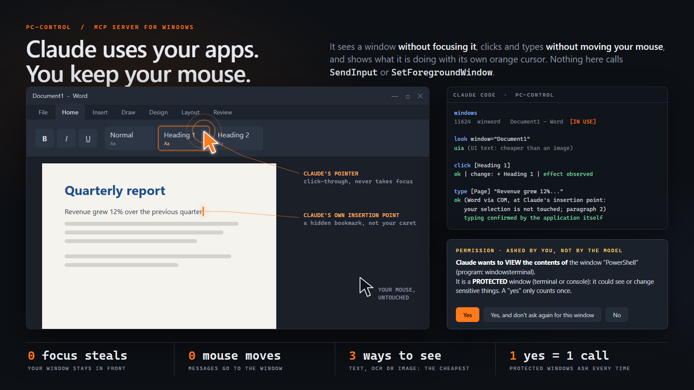

# PC-Control



Let an AI see and operate Windows apps cheaply, **without stealing focus, moving your mouse or typing on your keyboard**.
An MCP server for Claude Code (and any MCP client). Early version: it works, but expect rough edges.

- **Sees a window without focusing it.** `look` picks the cheapest of: UI-tree text, OCR text, or an image with numbered marks.
  It never sends empty text, text that costs more than the image, or text that does not cover the window.
- **Acts on a window without focusing it.** Clicks and typing go straight to the control (`BM_CLICK`, `EM_REPLACESEL`, UI Automation patterns...).
  Nothing in the package calls `SetForegroundWindow`, `SendInput`, `keybd_event` or `SetCursorPos` (a test scans the code for them).
- **Answers with only what changed** after each action, not the whole screen again, and says whether the action had a visible effect.
- **Does what people ask for, still without focus.** Scroll, read a whole document or page, keyboard shortcuts, drop-downs, find an element (even scrolled out of view) and wait for something to appear.
- **Opens apps out of your way.** `open_app` starts the app minimized (nothing on screen, no focus, its button in the taskbar), or on a hidden desktop with `hidden=true`.
- **Lets you keep working.** You and Claude can use the same app at the same time (see [You and Claude in the same app](#you-and-claude-in-the-same-app)).

Windows 10/11 only. Python 3.10+.

## Install

```powershell
git clone https://github.com/VortexJer/PC-Control.git
cd PC-Control
\install.ps1                  # installs the package and runs `pc-control install` (options: -Mode ask|auto|strict|bypass, -AllowReads, -Editable)
```

Or by hand, without cloning:

```powershell
pip install git+https://github.com/VortexJer/PC-Control.git
pc-control install
```

What `pc-control install` does (and nothing else):

| Step | Where |
|---|---|
| Registers the MCP server as **PC-Control** (`mcp__PC-Control__*`) | `claude mcp add` (scope `user` by default) |
| Writes the usage skill | `~/.claude/skills/pc-control/SKILL.md` |
| Adds a short managed block pointing to the skill | `~/.claude/CLAUDE.md` (between `<!-- pc-control:begin ... -->` and `<!-- pc-control:end -->`) |
| Registers the permission hooks (`PreToolUse`, `PermissionRequest`) | `~/.claude/settings.json` |
| Keeps a record of all of the above | `~/.claude/pc-control-install.json` |
| Backs up your settings before editing them (once) | `~/.claude/settings.json.pc-control-bak` |

Options: `--mode follow|auto|ask|strict|bypass` (default `follow`, see [Permission modes](#permission-modes)),
`--scope user|project|local`, `--allow-reads` (let `windows` and `look` run without asking).
Then open a **new** Claude Code session; the tools appear as `PC-Control`.

`pc-control status` shows whether it is installed, connected and paused. `pc-control pause` / `pc-control resume` is the kill switch.

## Uninstall

```powershell
pc-control uninstall           # removes everything install added, and the ~/.pc-control data folder
pip uninstall pc-control       # removes the package itself
```

or, from the checkout, `.\uninstall.ps1` (does both; add `-KeepData` to keep `~/.pc-control`, `-KeepPackage` to keep the package).

`pc-control uninstall` is exact: it uses the record written by `install`, so it removes the MCP registration, the skill folder, the
managed block in `CLAUDE.md` (the file itself is deleted only if `install` created it and nothing else is in it), our hooks, any
read permissions it added, the settings backup and the data folder. Skills, hooks, permissions and notes that are not ours are left untouched.

## Cost

`look` chooses by cost: it estimates what the text would cost and what an image of the window would cost (about `ceil(width/28) * ceil(height/28)`
tokens at the size it would send, which adapts to your monitor) and sends the cheaper one, never empty text and never text that does not
cover the window. After an action it sends only what changed. In one measured Word window, the UI-tree text cost 713 tokens against 851 for the screenshot;
a minimized window is read as text only.

## Permission modes

Pick one with `pc-control install --mode ...` or the `PC_CONTROL_MODE` environment variable.

| Mode | What it does |
|---|---|
| `follow` (default) | Follows Claude Code's own permission mode: in `bypass` PC-Control asks nothing, in any other mode it behaves like `auto`. |
| `auto` | Filters apps **by category**, no list to maintain: password managers and authenticators, terminals, system administration tools, remote access, crypto wallets, the AI client itself, mail and messaging apps, VPN/security tools, signing/identity apps, developer tools with credentials, and any window whose title is about banking, payments or passwords are *protected*: PC-Control asks you before Claude can use them. Delicate actions (pay, delete, send, install, sign out...) are asked every time. It never types into a password field. |
| `ask` | The lowest-risk mode: **every window** asks the first time Claude uses it in the session. Protected windows ask too. |
| `strict` | `auto` plus: acting only on apps listed in `PC_CONTROL_ALLOW=app1,app2` or `~/.pc-control/allow.txt`. |
| `bypass` | Like `--dangerously-skip-permissions`: no filters, no confirmations. Use it when you trust the session. |

In every mode: creating `~/.pc-control/PAUSE` (or `PC_CONTROL_PAUSE=1`) makes every tool refuse, and `type` needs an element id from `look` (no blind typing).

### How the questions reach you

Protected windows are **not blocked**; you decide, not the model. The model has no `confirm` flag it could set.

- **Claude Code:** the `PreToolUse` hook (`python -m pc_control.hook`) answers `ask`, so **Claude Code itself shows you its permission
  dialog** (with a plain-language description of what Claude wants to do) and Claude cannot answer it. A plain "yes" counts once.
  If you pick Claude Code's "Yes, and don't ask again", PC-Control narrows it to **that one window** for the rest of the session
  (Claude Code saves a per-tool rule; the hook turns it into a per-window approval and removes the rule).
- The `PermissionRequest` hook answers by itself when you do not need to be bothered (a normal window outside the filter, bypass).
  It also tells the server that a dialog really is about to be shown: once Claude Code has done that at least once, the server refuses
  to run a protected action whose dialog was skipped (for example by a "don't ask again" rule), instead of trusting the question.
- **Other MCP clients** that support elicitation get the question straight from the server.
- Without either, the action simply does not run.

## What you see: Claude's cursor

When Claude clicks, an **orange pointer** glides to the element and rings it; when it types, a steady **orange I-beam** slides to the
insertion point. Only one is shown at a time (the one for the last action; each stays at least a moment so a quick action is visible), and it
moves with its window. Both are transparent click-through windows that never take focus. They fade in when Claude starts and **stay visible,
idle at their last position, after it finishes** (`PC_CONTROL_CURSOR=always` default; `user`: only while you are in that window; `off`).
Their colour adapts to what is behind them and they scale with the screen DPI.

The cursor is **isolated to the app it acts on**: it is an owned window of the target, so it follows that window's place in the stacking
order. **Closing the app removes them for good; minimizing it only hides them** and they come back when you restore the window.
When Claude Code closes, the PC-Control server exits with it and takes the cursor away.

## Keeps working when you move or resize the window

Positions are resolved when Claude acts, not when it looked. Moving the window changes nothing (positions are relative to it); resizing
re-lays-out the controls, so each target is re-asked to its live control (or found again by name and type). A click with coordinates from
an old image is refused with a clear message instead of landing somewhere else.

Some changes cannot be absorbed: shrink a window enough and its ribbon collapses, so the button Claude was about to press no longer exists.
Then PC-Control does not guess: it shows a notice on that very window ("If you touch this application, Claude will not be able to act on it. ..."),
waits for you to put it back, and carries on by itself. If a button merely moved, PC-Control finds it again, clicks it and says so in the answer.

## You and Claude in the same app

You can keep working in the app while Claude works in it, as long as you do not hide or move its window:

- **Word:** Claude has its own insertion point (a hidden bookmark that follows the text if you edit before it). It writes there through COM
  and the answer says in which paragraph and after which words. The formatting buttons (bold, italic, alignment...) apply to what Claude
  writes, never to your selection. The Styles gallery (Heading 1, Normal, Strong...) works the same way: a style is Claude's own and is applied only to the new paragraph it starts (never to a paragraph of yours; if the text lands in one of yours, the answer says so). In Word `key` only offers `enter`, `space` and `backspace`, acting at Claude's own insertion point.
- **Your mouse:** if you are holding a mouse button (dragging, selecting), Claude waits for you to release it instead of breaking your gesture.
- **Your keyboard:** a key press waits until you stop typing, so it never lands in the middle of your word.
- **Right click** opens the app's real context menu, which closes with any click of yours, so Claude only opens it when you have been idle
  for a few seconds and no menu is open. Menu entries are pressed through UI Automation patterns (by id, like any button).

## Tools

| Tool | What it does |
|---|---|
| `windows` | Lists windows, most recent first; marks `[IN USE]` (where you work now), `[LAST USED]`, `[PROTECTED: ...]`, `(minimized)`, `(hidden)`. |
| `look` | Sees a window: UI-tree text, OCR text or an image with numbered marks, whichever is cheapest that works. Text fields show what they contain (never password fields). `find="Save|Cancel"` returns only the matching elements, also those scrolled out of view; `find="!Loading"` with `wait=10` waits until that text is gone. |
| `click` | Clicks an element id (or `x,y` of the last image); `right` and `double` supported. Title-bar buttons (minimize, maximize, close) and elements of apps that ignore mouse messages are pressed through UI Automation. |
| `type` | Types into an element id (append, or `replace`) and reads the field back to confirm the text is really there. On a drop-down or list (classic, WinForms, web `<select>`) it picks the entry with that text, and the app's change event fires. |
| `drag` | Holds the button and drags through points (freehand, line, rectangle, ellipse) using mouse messages: no real mouse, no focus. Apps with modern canvases may ignore it. |
| `key` | A key (`enter`, `tab`, `esc`, arrows, `f1`-`f12`...) or a shortcut (`ctrl+s`, `ctrl+shift+n`, `alt+f4`). Shortcuts never press real keys: PC-Control runs the app's own menu command that shows that shortcut, the element declaring it, or the text-box command (`ctrl+a/c/x/v/z`). If the app has no such command, the answer lists the shortcuts it does have (they depend on its language: in Spanish Notepad, Save is `Ctrl+G`). |
| `scroll` | Scrolls the window or an element by pages, or to the top/bottom, through UI Automation, scroll-bar messages or wheel messages: no focus, no mouse. Says the position before and after. |
| `read` | The whole text of a document, web page, editor or field, also what is scrolled out of view, in pieces (`start`, `length`). Much cheaper than scrolling and looking. Never reads password fields. |
| `open_app` | Launches an app minimized, or on a hidden desktop. |

## Adapts to your PC

- Cursor and caret scale with the DPI of the window they point at (100-300 %, per monitor).
- Screenshots adapt to the monitor the window is on (about 55 % of its long edge, between 768 and 1344 px, never upscaled).
- OCR uses your Windows languages (falls back to English/Spanish, and to images if there is none).
- Delicate-action and sensitive-window detection knows English, Spanish, French, German, Italian and Portuguese; protected app
  categories are matched by process name, which is language independent.
- Multi-monitor setups and negative coordinates are handled.

## Known limits

- Shortcuts work only where the app exposes them as a command (a classic menu, a menu entry or element with that shortcut, or a text box). Modern menus (WinUI, WPF) only exist while open, so they are searched only for apps on the hidden desktop: opening them on your desktop could take the focus.
- Windows running as administrator cannot be read from a normal process (Windows blocks it).
- Modern Store/XAML apps (Calculator, Paint, Settings) ignore mouse messages sent to a background window. For buttons, PC-Control notices that a click had no visible effect and presses the element through UI Automation `Invoke` (what a screen reader does: no mouse, no focus), and the answer says so. A drawing canvas has no such pattern, so `drag` does nothing there (modern Paint).
- Store apps also ignore "start minimized": opening Calculator brings it to the front.
- Chromium browsers (Chrome, Edge) and Electron apps expose the page contents only while their accessibility support is on; if a page shows only the browser's own controls, start it with `--force-renderer-accessibility`. Web fields are filled through UI Automation (no focus), and web buttons and checkboxes are pressed the same way.
- Apps without an accessibility tree rely on OCR; apps that draw everything themselves (some games) may need images.
- A minimized window is read through its UI tree only (no capture: it would have to be shown). If that is not enough, relaunch with `hidden=true`.
- Store (UWP) apps cannot run on a hidden desktop.
- Background typing through `WM_CHAR` is not accepted by every app (the modern Notepad ignores it); use element ids.
- Opening an app while you are typing can let Windows briefly activate its window; PC-Control cannot prevent that without stealing focus itself.

## Tests

The tests never touch your real apps: they use throw-away windows (off screen or on a hidden desktop) and a simulated Word. `test_cursor`
shows the orange cursor for a few seconds. Run them one by one:

```powershell
python tests/test_decide.py       # cost/quality rules
python tests/test_static.py       # no intrusive API calls in the package
python tests/test_background.py   # clicks and typing without focus
python tests/test_hidden.py       # hidden desktop: never on your screen
python tests/test_taskbar.py      # minimized + taskbar button: never on your screen
python tests/test_tuck.py         # when a new window is (not) sent behind
python tests/test_server.py       # MCP server end to end, with its safety rules
python tests/test_policy.py       # permission modes and categories
python tests/test_hook.py         # the permission hooks
python tests/test_cursor.py       # the orange cursor (shows it for a few seconds)
python tests/test_resize.py       # moving / resizing the window mid-action
python tests/test_word.py         # Word: Claude's own insertion point (simulated Word)
python tests/test_input_share.py  # you and Claude working in the same app
python tests/test_drag.py         # drag / draw
python tests/test_menu.py         # menu entries pressed through accessibility
python tests/test_menu_real.py    # ... against a real Windows menu
python tests/test_more.py         # scroll, read, shortcuts, drop-downs, find and wait
python tests/test_web.py          # the same on a real web page in Edge (skipped without Edge)
python tests/test_unnamed_field.py # fields and buttons without an accessible name still get an id
python tests/test_cli.py          # install / uninstall / status / pause
python tests/test_hygiene.py      # license, README, no personal data
```

## Diagnostics

`python tools/input_monitor.py out.log stop.flag` logs focus changes, new windows, the desktop that receives input, mouse clipping and
capture, so you can check that PC-Control never takes your focus or input.

## License

MIT
